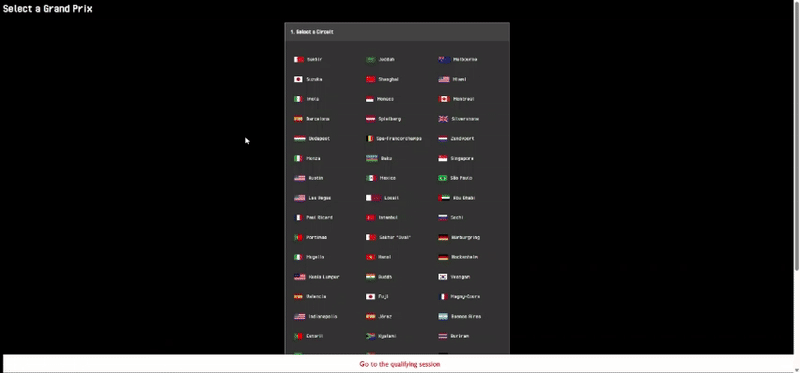
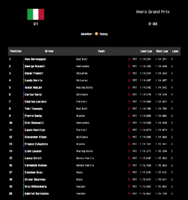
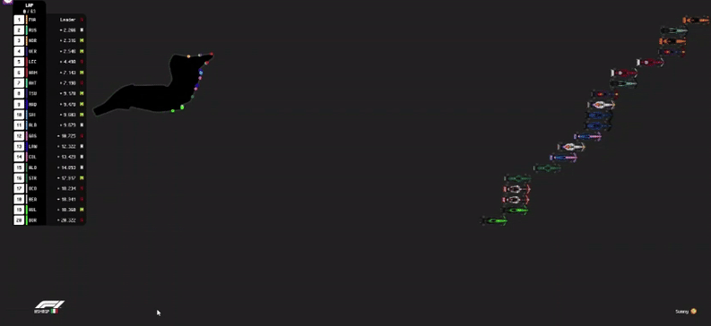

# MiniF1

**MiniF1** is an ultra-simplified Formula 1 simulation engine.  
The current version (v0) allows you to spectate qualifying sessions and races directly from your browser.  
Future versions will support season simulations and even basic driver control!

---

## 🏁 Features (v0)

- Interactive **Grand Prix setup** (choose the circuit, teams, drivers, and stats)
- **Qualifying simulation** with Q1, Q2, Q3 phases (`quali.html`)
- **Race simulation** with DRS, gaps, rain and track evolution (`race.html`)
- **Spectator mode** only – you watch how the event unfolds, no control yet
- Option to enable **sprint race mode**
- Data is stored in `localStorage`, so the entire simulation works in the browser (no backend)

---

## 🚀 How to use

You can:
- Run it directly from [GitHub Pages](https://16bravo.github.io/MiniF1/)
- Or clone the repository and open `index.html` locally in your browser

**Start from `index.html`**, where you can:
1. Select a circuit
2. Customize teams (names, colors, images) and driver stats
3. Launch the event

The simulation will chain:
- Qualifying session (`quali.html`)
- Race (`race.html`) – accessible via a button after qualifying

⚠️ `quali.html` or `race.html` can run independently **only if data has been initialized in `localStorage`**.

---

## 🛠 Technologies

- HTML / CSS / JavaScript (Vanilla, no framework)
- `localStorage` for all runtime data
- Python scripts (in `script/`) to generate JSON assets (circuits, drivers, etc.) from Excel files  
  👉 These are optional and not needed to run the simulation

---

## 📸 Screenshots

---

## 🌱 About this project

This is a personal side project created for fun, learning, and family!  
The idea is to have a simple F1 simulator accessible anywhere (via GitHub Pages), especially to let younger players (like my nephews) enjoy racing.

It's not meant to be professional – but it is coded seriously, and open to curious and kind people.

---

## 🧭 Roadmap

### v1 – Career Mode
- Configure full seasons with multiple circuits and evolving driver rosters
- Track points, standings and championship stats across races
- Expand pilot database and allow multi-season play

### v2 – Player Control
- Take control of one pilot
- Very simple interactive gameplay (mini-games, choices) to determine performance
- Player scores will feed into the simulation engine

---

## 📄 License

To be defined – for now: personal and educational use encouraged.

---
