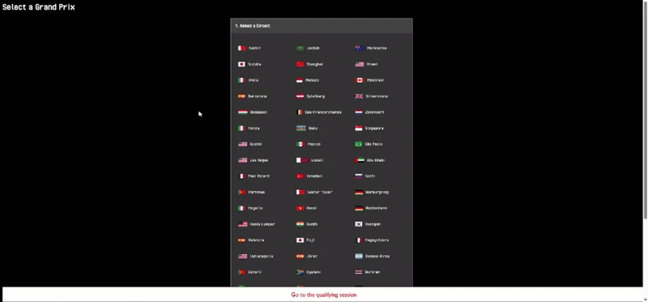
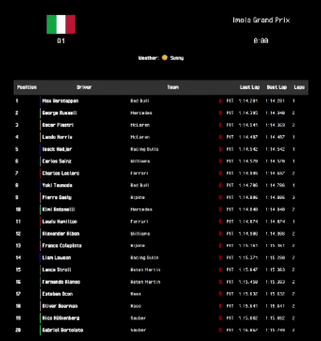
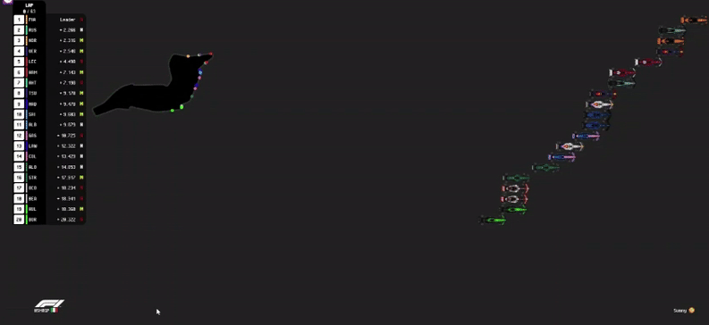

# MiniF1

**MiniF1** is an ultra-simplified Formula 1 simulation engine.  
Build your own F1 seasons, customize teams & drivers, and watch realistic qualifying and race simulations unfold in your browser – with full championship tracking, race replays, and point systems.

---

## 🏁 Features

### 🏎️ **Simple GP** – Single Race Mode
- Interactive Grand Prix setup (choose circuit, teams, drivers, and customize stats)
- **Qualifying simulation** with Q1, Q2, Q3 phases
- **Race simulation** with DRS, gaps, rain, and track evolution
- Full race data recording for instant replay
- Option to enable **sprint race mode**

### 🏆 **Championship** – Full Season Mode
- Configure multi-circuit championship seasons
- **Point system** tracking across all races
- **Driver & team standings** updated after each race
- Save and load championship progress
- Access qualifying and race data for every round

### 🎬 **Replay** – Watch Your Races
- Instant replay of any recorded race
- Revisit championship rounds with full metadata
- Rewatch qualifying sessions or races on demand

### 🎨 **Customization**
- Personalize team names and colors
- Adjust driver skill stats before races
- Modify circuit difficulty and weather conditions

### 💾 **Data Persistence**
- Entire simulation runs in your browser (no backend required)
- All data stored in `localStorage` for seamless offline play
- Championships save automatically

---

## 🚀 How to use

You can:
- Run it directly from [GitHub Pages](https://16bravo.github.io/MiniF1/)
- Or clone the repository and open `index.html` locally in your browser

**From the home menu (`index.html`)**, select your mode:

### 🏎️ Simple GP
1. Select a circuit
2. Customize teams (names, colors) and driver stats
3. Launch the event
4. Watch qualifying → then the race unfolds automatically

### 🏆 Championship
1. Add multiple circuits to your season
2. Start the championship
3. Run each Grand Prix in sequence
4. View live standings and championship progression
5. Save your progress and continue later

### 🎬 Replay
1. Select a previously recorded race
2. Watch the full event unfold again

⚠️ `quali.html` or `race.html` can run independently **only if data has been initialized in `localStorage`**.

---

## 🛠 Technologies

- HTML / CSS / JavaScript (Vanilla, no framework)
- `localStorage` for all runtime data
- Python scripts (in `script/`) to generate JSON assets (circuits, drivers, etc.) from Excel files  
  👉 These are optional and not needed to run the simulation

---

## 📸 Screenshots

---

## 🌱 About this project

This is a personal side project created for fun, learning, and family!  
The idea is to have a simple F1 simulator accessible anywhere (via GitHub Pages), especially to let younger players (like my nephews) enjoy racing.

It's not meant to be professional but it is open to curious and kind people.

---

## 🧭 Roadmap

### v1 – Sprint Weekends (In Progress)
- Sprint race weekend configuration & simulation
- Combined qualifying + sprint + main race weekend format

### v2 – Career Mode
- Multi-season career progression
- Evolving driver and team rosters
- Career statistics and historical records
- Advanced season customization

### v3 – Player Control & Game Mode
- Take control of one pilot
- Interactive mini-games to influence performance
- Player choices affecting race outcomes
- Competitive career progression system

---

## 📄 License

To be defined – for now: personal and educational use encouraged.

---
