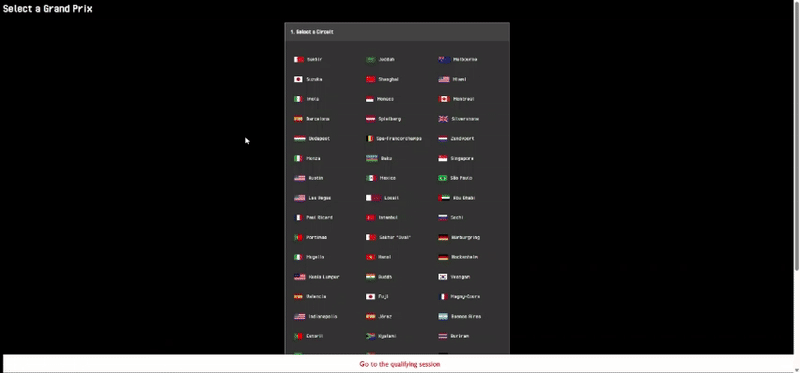
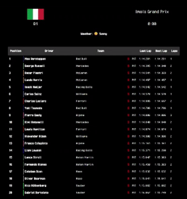
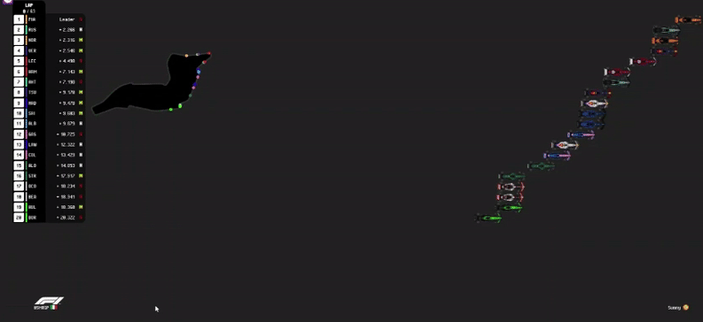

# MiniF1

**MiniF1** is an ultra-simplified Formula 1 simulation engine.  
Build your own F1 seasons, customize teams & drivers, and watch realistic qualifying and race simulations unfold in your browser – with full championship tracking, multi-season careers, race replays, and point systems.

---

## 🏁 Features

### 🏎️ **Simple GP** – Single Race Mode
- Interactive Grand Prix setup (choose circuit, teams, drivers, and customize stats)
- **Qualifying simulation** with Q1, Q2, Q3 phases
- **Race simulation** with DRS, gaps, rain, and track evolution
- Full race data recording for instant replay
- Option to enable **sprint race mode**

### 🏆 **Championship** – Full Season Mode
- Configure multi-circuit championship seasons, with optional **sprint race weekends**
- Fully **customizable points system**, including fastest-lap and pole-position bonus points
- **Driver & team standings** updated after each race, with live stats and points-progression charts
- A discreet indicator flags a title as mathematically clinched as soon as it's out of reach
- Save and load championship progress
- Access qualifying and race data for every round

### 🏁 **Career** – Long-Term Mode
- Play a multi-season career as an overall manager across the whole grid (God Mode)
- Teams and drivers carry over automatically from one season to the next, reordered to match the previous season's constructors' standings
- **History Stats**: a career-long leaderboard for every driver and team, each with a detail popup showing full career totals and a year-by-year finishing-position timeline, blended with real F1 history
- Dedicated career save slots, separate from one-off Championships
- Team Principal and Driver career modes are planned (see [Roadmap](#-roadmap))

### 🎬 **Replay** – Watch Your Races
- Instant replay of any recorded race
- Revisit championship rounds with full metadata
- Rewatch qualifying sessions or races on demand

### 🎨 **Customization**
- Personalize team names and colors
- Adjust driver skill stats before races
- Modify circuit difficulty and weather conditions

### 💾 **Data Persistence**
- Entire simulation runs in your browser (no backend required)
- All data stored in `localStorage` for seamless offline play
- Championships save automatically

---

## 🚀 How to use

You can:
- Run it directly from [GitHub Pages](https://16bravo.github.io/MiniF1/)
- Or clone the repository and open `index.html` locally in your browser

**From the home menu (`index.html`)**, select your mode:

### 🏎️ Simple GP
1. Select a circuit
2. Customize teams (names, colors) and driver stats
3. Launch the event
4. Watch qualifying → then the race unfolds automatically

### 🏆 Championship
1. Add multiple circuits to your season
2. Start the championship
3. Run each Grand Prix in sequence
4. View live standings and championship progression
5. Save your progress and continue later

### 🏁 Career
1. Create or load a career save slot
2. Play each season as a full championship
3. At season's end, teams, drivers and the calendar carry over automatically into the next season
4. Track long-term records in the History Stats tab

### 🎬 Replay
1. Select a previously recorded race
2. Watch the full event unfold again

⚠️ `quali.html` or `race.html` can run independently **only if data has been initialized in `localStorage`**.

---

## 🛠 Technologies

- HTML / CSS / JavaScript (Vanilla, no framework)
- `localStorage` for all runtime data
- Python scripts (in `script/`) to generate JSON assets (circuits, drivers, etc.) from Excel files  
  👉 These are optional and not needed to run the simulation

---

## 📸 Screenshots

---

## 🌱 About this project

This is a personal side project created for fun, learning, and family!  
The idea is to have a simple F1 simulator accessible anywhere (via GitHub Pages), especially to let younger players (like my nephews) enjoy racing.

It's not meant to be professional but it is open to curious and kind people.

---

## 🧭 Roadmap

### ✅ Done
- Sprint race weekends (qualifying + sprint + main race format)
- Career mode: multi-season progression as an overall manager (God Mode), with career statistics and historical records

### 🔜 Next – Career: Team Principal Mode
- Play a career from inside a single team instead of managing the whole grid
- Team-level decisions and long-term development

### 🔮 Later – Career: Driver Mode & Game Mode
- Take control of one pilot
- Interactive mini-games to influence performance
- Player choices affecting race outcomes
- Competitive career progression as a driver

---

## 📄 License

MIT License – see [LICENSE](LICENSE) for details.

---
